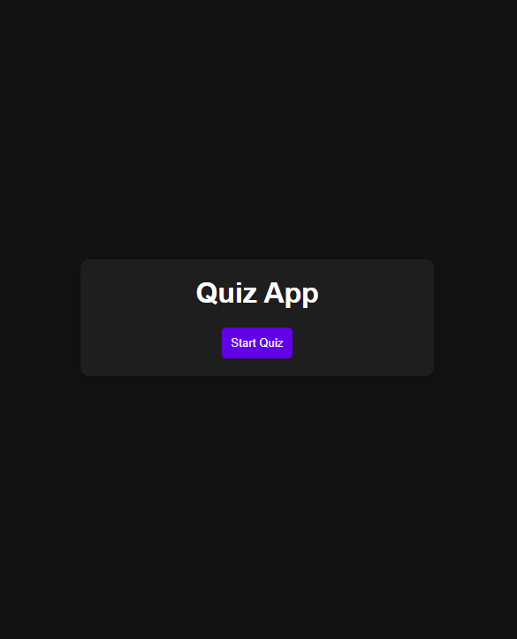
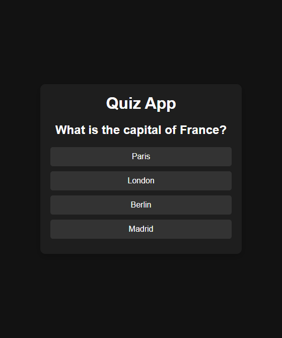
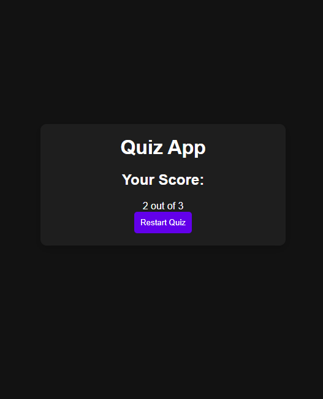

# Quiz Application 🎯

A simple and interactive **Quiz App** built using **HTML, CSS, and JavaScript**.  
Users can start the quiz, answer multiple-choice questions, view their score, and restart the quiz.

---

## 🚀 Live Demo
🔗 [Hosted URL Here](https://rajdipchatterjee.github.io/Quiz-01/)

---

## 📸 Screenshots

### 🖼️ Home Screen

### 🖼️ Question Screen

### 🖼️ Result Screen

---

## ✨ Features
- 🎮 Start and Restart the quiz anytime  
- ❓ Multiple-choice questions with clickable options  
- ✅ Score calculation at the end of the quiz  
- 🔄 Restart button to retake the quiz  

---

## 🛠️ Tech Stack
- **HTML** – Structure  
- **CSS** – Styling  
- **JavaScript** – Functionality & Interactivity  
